  
   
  

---

## Objective

> This project aims to broaden your knowledge of system administration by using Docker. You will virtualize several Docker images, creating them in your new personal virtual machine.

```mermaid
---
title: Inception flow
---

%%{ init: { 'flowchart' : { 'curve': 'basis' } } }%%

flowchart LR

net(("internet"))
nginxMan["nginx mandatory"]
wpPHP["wordpress mandatory"]
wpDB[("wordpress database")]
mariaCont["mariadb mandatory"]
mariaDB[("mariadb database")]
redis["redis"]
FTP["FTP"]
STATIC["static website"]
ADMINER["adminer"]
EXTRA["extra service"]

nginxMan <==port 443==> net
net <==> STATIC
subgraph HP["HOST PC"]
  subgraph DN["DOCKER NETWORK"]
    mariaCont <==port 3306==> wpPHP
    wpPHP <==port 9000==> nginxMan
    wpPHP <==> redis
    subgraph B1["BONUS"]
      ADMINER
      redis
      FTP
      STATIC
      EXTRA
    end
  end
  mariaCont <==> mariaDB
  wpPHP <==> wpDB
  wpDB <==> nginxMan
  wpDB <==> FTP
end


style DN fill:#2496ED,color:#000
style HP fill:#444444
style net fill:#aaaaaa,color:#000
style nginxMan fill:#009639
style wpPHP fill:#21759B
style wpDB fill:#0E4268
style mariaCont fill:#003545
style mariaDB fill:#000212
style B1 fill:#FFFF00,color:#000
linkStyle 0,2,3 color:#F00
```

