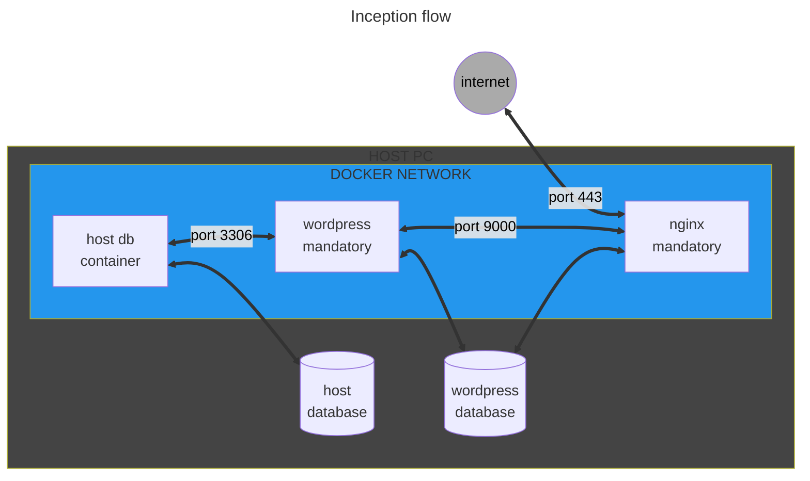

  
   
  

```mermaid
---
title: Inception flow
---

%%{ init: { 'flowchart' : { 'curve': 'natural' } } }%%
flowchart LR

net(("internet"))
nginxMan["nginx
  mandatory"]
wpPHP["wordpress
  mandatory"]
wpDB[("wordpress
  database")]
outCont["host db
  container"]
outDB[("host
  database")]

net <==port 443==> nginxMan

subgraph HP["HOST PC"]
  subgraph DN["DOCKER NETWORK"]
    outCont <==port 3306==> wpPHP
    wpPHP <==port 9000==> nginxMan
  end
  outCont <==> outDB
  wpPHP <==> wpDB
  wpDB <==> nginxMan
end

style DN fill:#2496ED
style HP fill:#444444
style net fill:#aaaaaa,color:#000
linkStyle 0,1,2 color:#000 
```
